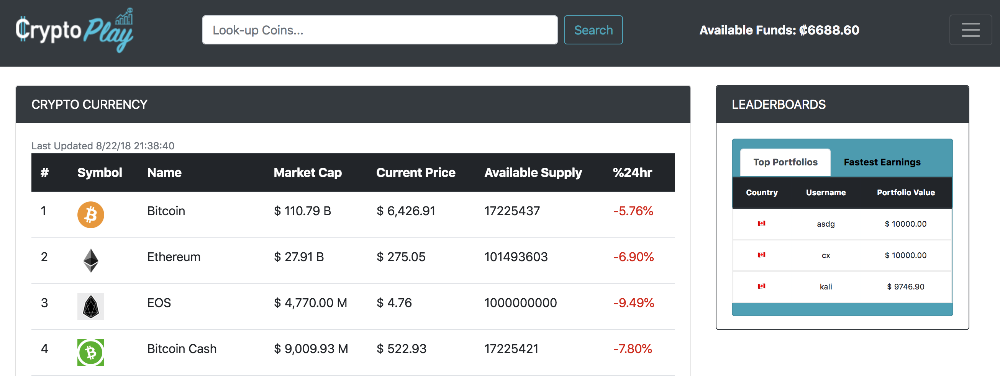
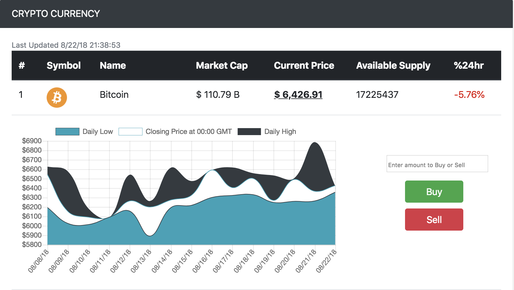
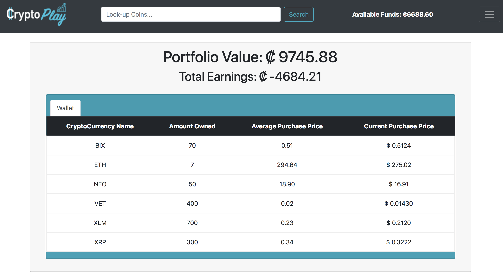
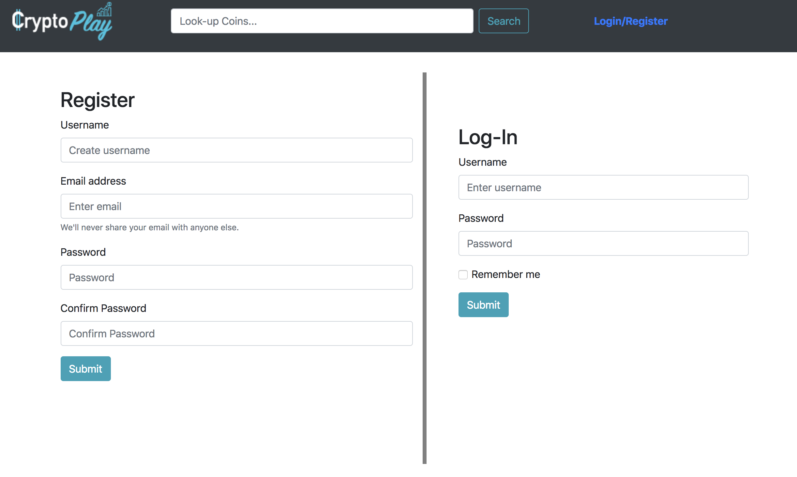
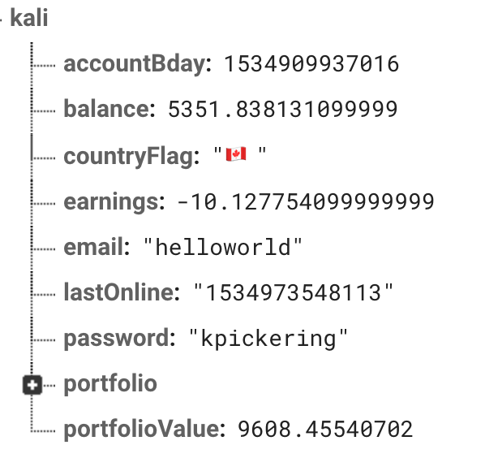
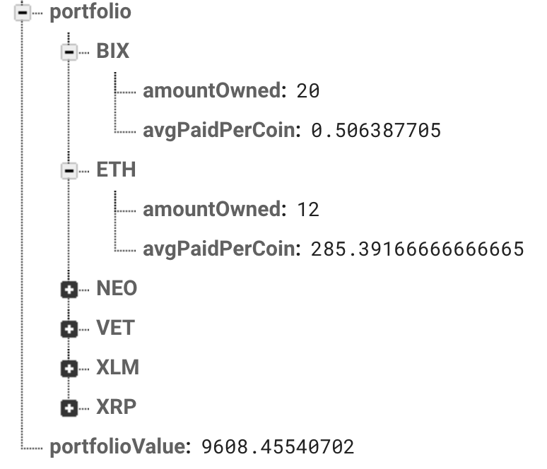

# CryptoPlay

### Overview

CryptoPlay is a virtual currency playground designed to simulate buying and selling in the cryptocurrency market.

### Snapshot/video

#### Homepage

#### Display Graph

#### Portfolio Page

#### Sign-up Page

### Firebase

### Contributors
[Arvin Zojaji](https://github.com/arv433)

[Altaf Dasurkar](https://github.com/altafdkr)

[Kaliesha Pickering](https://github.com/kalieshapickering)

### Link to game

Play [CryptoPlay !](https://kalieshapickering.github.io/CryptoPlay/index.html)

